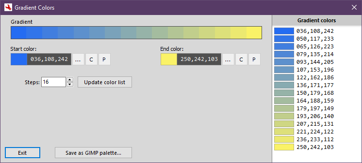
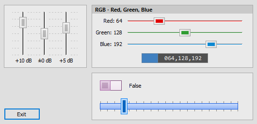

# JPModLib

- [JPModLib](#jpmodlib)
  - [Overview](#overview)
  - [JPEssential](#jpessential)
    - [TJPEsGradient](#tjpesgradient)
  - [JPPegTop](#jppegtop)
    - [TJPPegTopTrackBar, TJPPegTopColorTrackBar, TJPPegTopRangeBar](#tjppegtoptrackbar-tjppegtopcolortrackbar-tjppegtoprangebar)
  - [JPJVCL](#jpjvcl)
    - [TJPJvSpinEdit](#tjpjvspinedit)
    - [TJPJvCheckBox](#tjpjvcheckbox)
    - [TJPJvRadioButton](#tjpjvradiobutton)
  - [JPLaz](#jplaz)
    - [TJPLazSpinEdit](#tjplazspinedit)
    - [TJPLazFloatSpinEdit](#tjplazfloatspinedit)

---

## Overview

**JPModLib** - Modified Delphi components from other open source packages / libraries.

Supported Delphi versions: **2009** - **10.4 Sydney**

To install, you need the **JPLib** library from https://github.com/jackdp/JPLib and **JPPack** from https://github.com/jackdp/JPPack

To install **JPVCL** package, you need also **JVCL** for https://github.com/project-jedi/jvcl

---

## JPEssential

A modified components from the **TurboPack Essentials** package (https://github.com/TurboPack/Essentials).

### TJPEsGradient

Modified `TEsGradient` component.

My modifications:

* `gGradColors` array moved to the **public** part
* `DrawBorder`
* `BorderColor`
* `TagExt`

In one of my applications I needed a gradient component with access to all partial colors. **TEsGradient** turned out to be almost perfect. All generated colors are saved in the `gGradColors` array. In the original unit, it is declared in the **private** part, so it was necessary to move it to the **public** section.

By the way, I added the option of drawing borders.

Original license: [MPL 1.1](https://www.mozilla.org/en-US/MPL/1.1/)  
License for my modifications: **Public domain. You can do with my code whatever you want without any cost and without any limitations.**

---

## JPPegTop

### TJPPegTopTrackBar, TJPPegTopColorTrackBar, TJPPegTopRangeBar

An advanced track bars for Delphi.

A modifed `TPegTopTrackBar`, `TPegTopColorTrackBar` and `TPegTopRangeBar` from the **PegTop Common Components** written by Jens Gruschel
(http://www.pegtop.net/delphi/components/common/index.htm).

My modifications:

* A large amount of code related mainly to the appearance of the control.
* `PositionLabel` - External label displaying the current position. Track bars also have internal labels, but they can only be set above and below the control.
* Ticks support
* `TagExt`

[PegTop license](./libs/Pegtop/PegTop_License.txt)  
License for my modifications: **Public domain. You can do with my code whatever you want without any cost and without any limitations.**

---

## JPJVCL

A modified components from the **JVCL** package (https://github.com/project-jedi/jvcl).

### TJPJvSpinEdit

A modified `TJvSpinEdit`.  
New properties:

- `BoundLabel`
- `RightLabel`
- `AnchoredControls`
- public property `IntValue`: integer.;

### TJPJvCheckBox

`TJvCheckBox` with the `AnchoredControls` support.

### TJPJvRadioButton

`TJvRadioButton` with the `AnchoredControls` support.

License for my modifications: **Public domain. You can do with my code whatever you want without any cost and without any limitations.**

## JPLaz

A modified components from the [Lazarus IDE](https://www.lazarus-ide.org/).

### TJPLazSpinEdit

A modified `TSpinEdit`.  
New properties:

- `BoundLabel`
- `RightLabel`
- `AnchoredControls`

### TJPLazFloatSpinEdit

Similar to TJPLazSpinEdit.

